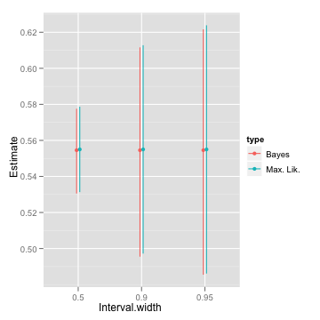

latex input:            mmd-tufte-handout-header  
Title:                  statistical rethinking, homework 1
Base Header Level:      2
latex mode:                     memoir  
author:           Jaime Ashander
copyright:                      2011 Jaime Ashander
                                        This work is licensed under a Creative Commons License.  
                                        http://creativecommons.org/licenses/by-nc-sa/3.0/  
latex input:            mmd-natbib-plain
latex input:            mmd-tufte-handout-begin-doc  
latex footer:           mmd-tufte-footer

# Problem 1  

First load the data, `birth1` and `birth2`, which indicate the gender (male=1, female=0) of reported first (second) born children in 100 families.
All families in this country have a maximum of two children.

    data(homeworkch2)  #

## Problem 1 a

  Data are generated by binomial trials with probability of obtaining a boy `p.b`, 
    p.b = seq(from = 0, to = 1, length.out = 1000)
    prior = rep(1/1000, 1000)
    likelihood = dbinom(sum(birth1) + sum(birth2), 
        size = length(c(birth1, birth2)), prob = p.b)  # likelihood of data given 1000 models (binomial success parameter)
    naive.posterior = prior * likelihood
    dat = data.frame(prior = prior, likelihood = likelihood, 
        posterior = naive.posterior, probability.boy = p.b)
    pb.max = p.b[-log(likelihood) == min(-log(likelihood))]

  The model `p.b = 1` maximizes the posterior probability
    print(pb.max)
    ## [1] 0.5546
    qplot(probability.boy, posterior, data = dat, 
        geom = "line")

  

# Colophon 

Written using the excellent [knitr](http://yihui.github.com/knitr/).

Need to use not only the options below suggested by knitr docs

    #opts_knit$set(theme='gfm',
    #   base.url='https://github.com/ashander/stat-rethink/raw/master/')

but also 

    #opts_knit$set(out.format='gfm')

